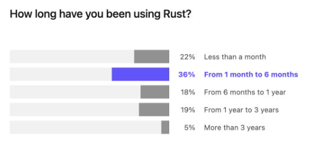
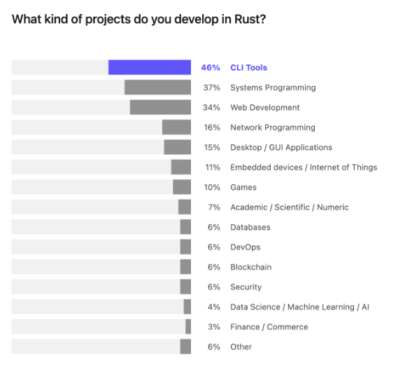

<!--
footer: "    @U007D (Credit: Icons created by Freepik, Md Tanvirul Haque, riajulislam - [Flaticon](https://www.flaticon.com/free-icons))"
-->
# Seattle Rust User Group
## 2023.01 Meeting (July 13, 2023)

These slides may be found at [github.com/u007d/srug-presentations](https://github.com/u007d/srug-presentations/tree/main/2023.01/2023.01.pdf)

---
<!--
footer: ""
-->
# Thank You
* For Coming!
* To Microsoft
* To Joe R.

---
# Codes of Conduct
* [developer.microsoft.com/en-us/reactor/CodeOfConduct/](https://developer.microsoft.com/en-us/reactor/CodeOfConduct/)
* [rust-lang.org/policies/code-of-conduct](https://www.rust-lang.org/policies/code-of-conduct)
<!--
* For coming
* To Microsoft
    - We're guests
    - CoC
* To Joe
-->

---
# Introductions - Brad
Online: U007D (aka "Curly") 

**Bias:** 
Correct, Maintainable & Efficient Software
Complex, Large-Scale, Team-Developed

**Tools:**
Safe, High-Level Abstraction Systems Language

**Language History:**
BASIC, 6510 & 68K Assembly, C, C++, Delphi (Object Pascal), Rust

---
# Introductions - Marianne
* Rust backend engineer working with secure network and kernel security interfaces 
* Discovered Rust at O'Reilly OSCON 2018
* Background in HCI and product/analytics 
* Leading Rust based FOSS pilot with MinT
* TWiR co-editor
* French music collector

---
# Goals for Seattle Rust User Group
* Continue to grow this community.
* Provide a place where people can have fun learning about and building cool things using Rust.
* Create a space to grow meaningful friendships in a collaborative and helpful community.

---
<!--
footer: "Source: [The State of Developer Ecosystem 2022 in Rust](https://blog.jetbrains.com/rust/2023/01/18/rust-deveco-2022-discover-recent-trends/)"
-->
# Rust Community: Who Are We?

---
# Rust Community: Who Are We? (2)

---
# Rust Community: Who Are We? (3)

---
<!--
footer: ""
-->
# Default Meeting Format
* General Announcements
    * From Group Organizers
    * From Membership
* Pitches
    * Lightning Talks and/or
    * Project Introductions and/or
    * Member Presentations or
    * Guest Speakers

---
# Future Directions for the Group
* Food?
* Launch Special Interest Groups (SIGs)
* Restart **Physical Computing** (Embedded) SIG
    * Redmond Public Library
* Community Outreach
* Commercial Engagement?
* Other Ideas?

### Next Meeting: Tue. Aug. 15, 2023 6-8:30p

---
# An Invitation
### Making New Friends
* Introductions
* Lightning Talks
* Project Introductions

---
# Q&A

---
# Project Spotlight
## Domain-Specific Language Runtime Graph Rewriter
---
# Presentation
## Intro to Idiomatic Error Handling in Rust
[https://github.com/u007d/srug-2023.01-wc](https://github.com/U007D/srug-2023.01-wc)