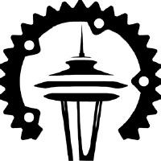

# Seattle Rust User Group
## 2023.10 Meeting (October 19, 2023)

These slides may be found at [github.com/u007d/srug-presentations](https://github.com/u007d/srug-presentations/tree/main/2023.03/2023.03.pdf)

---
<!--
footer: ""
-->
# Thank You
* For Coming!
* To Microsoft

---
# Codes of Conduct
* [developer.microsoft.com/en-us/reactor/CodeOfConduct/](https://developer.microsoft.com/en-us/reactor/CodeOfConduct/)
* [rust-lang.org/policies/code-of-conduct](https://www.rust-lang.org/policies/code-of-conduct)

---
# Introductions

* **Brad G.** (Organizer)
Online: U007D (aka "Curly") 
 
* **Marianne G.** (Organizer)

* **You**
---
# SRUG After-Event
* We often hang around outside after the meeting for 1 hour+.
* Fall/winter weather is coming!  Why not be comfortable?  :)
* All are invited to join us tonight at:
    Flatstick Pub
    7530 164th Ave. NE #A108
    Redmond, WA
    425-507-8349
    (https://www.yelp.com/biz/flatstick-pub-redmond-redmond)
---
### Next SRUG Meetings
* Thu. Nov. 16, 2023 6-8:00p
* Thu. Dec. 14, 2023 6-8:00p
* Microsoft Reactor, Redmond, WA (here)

### SRUG Discord
* https://discord.gg/RMc8VnKAR (link expires after30d!)

---
# General Discussion / Open Q&A
---
# 15-Minute Break
---
# Presentation:  
## Idiomatic Error Handling in Rust #2 (Video Book Club)
* Speaker: Brad G.
---
# Presentation:
## Introduction to JetPorch
* Speaker: Andrew P.
