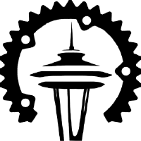

# Seattle Rust User Group
## 2024.01 Meeting (January 18, 2024)

These slides may be found at [github.com/u007d/srug-presentations](https://github.com/u007d/srug-presentations/tree/main/2024.01/2024.01.pdf)

---
# Thank You
* For Coming!
* To Microsoft

# Codes of Conduct
* [developer.microsoft.com/en-us/reactor/CodeOfConduct/](https://developer.microsoft.com/en-us/reactor/CodeOfConduct/)
* [rust-lang.org/policies/code-of-conduct](https://www.rust-lang.org/policies/code-of-conduct)

---
# Introductions

* **Brad G.** (Organizer)
Discord: U007D (aka "Curly") 
 
* **Marianne G.** (Co-organizer)
Discord: nini_raviolette
 
* **You**
---
### Next SRUG Meetings
* Thu. Feb. 15, 2024 6-8:00p (3rd Thursday)
* Thu. Mar. 21, 2024 6-8:00p (3rd Thursday)
* Microsoft Reactor, Redmond, WA (here)
---
# Rust-Related News & Events / General Discussion / Open Q&A
* Linux North America OSS conf (April 16-18 at the Seattle Convention center)
---
# SRUG Connections
### SRUG Discord Group
* https://discord.gg/UuwHAyWqXA

### After-meet Gathering
* All are invited to join us tonight at **Flatstick Pub** (@ RTC)

### 15-Minute Break
---
# Presentation:
## Object Soup is Made of Indexes (related blog)
* https://jacko.io/object_soup.html 
* Presented by Jack O.
---
# Presentation:
## Pratt Parsers
* Presented by Bhargav V.
---
# Presentation:
## Intro to `release-plz` - a tool that makes releasing / publishing crates easy
* Presented by Doug S.
---
# Presentation:
## Lightning Talks
* Speaker: Various
---
# Thank you!